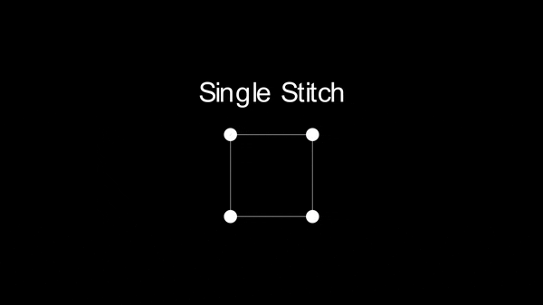
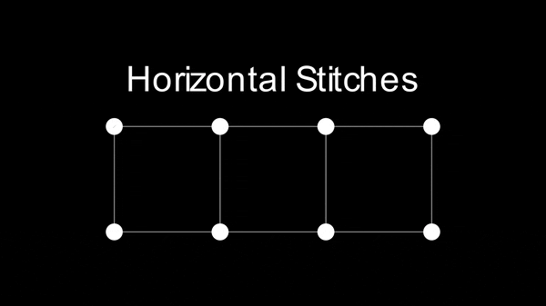
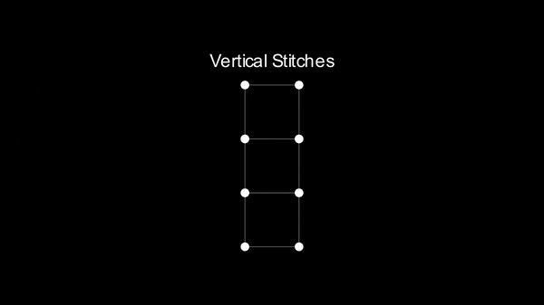
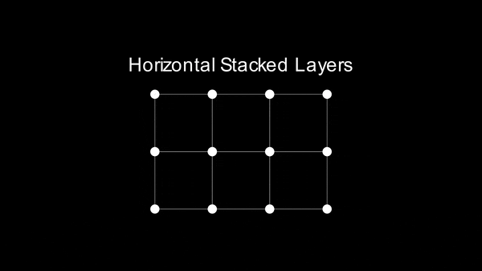
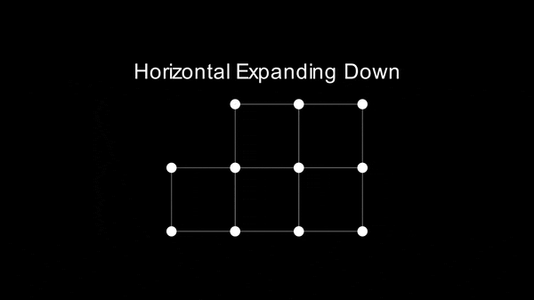
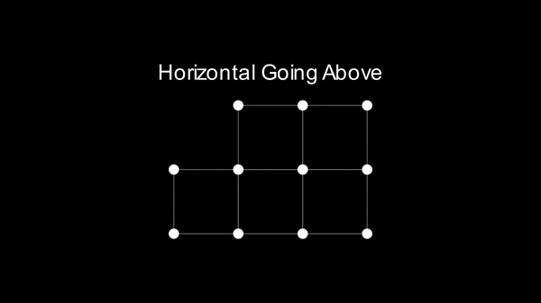
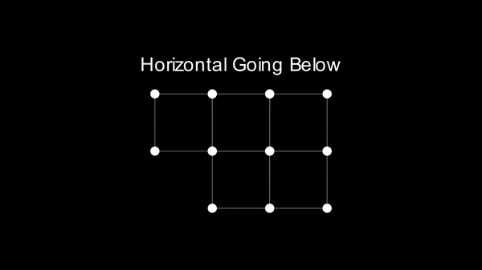
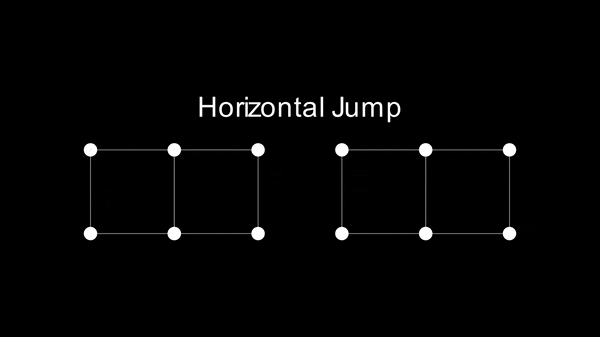
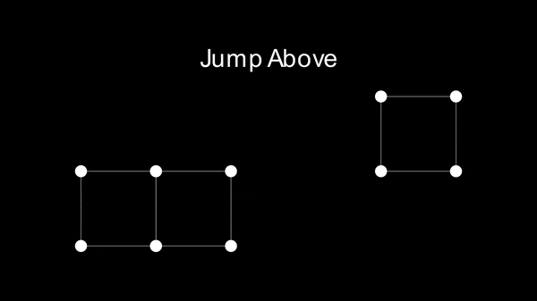
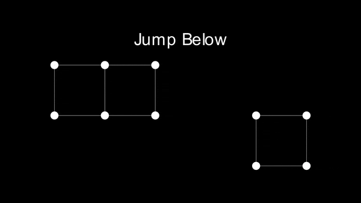

# stitches
A collection of animations using manim which show the patterns I follow when doing cross stitch.

Solid lines are stitches visible on the front. Purple (between top left and bottom right) always goes first, and green (between top right and bottom left) always goes second.

Dashed lines are stitches on the back. I aim to always keep these stitches either horizontal or vertical (not diagnonal).

## Standard Stitch

Top left to Bottom right first, then top right to bottom left second.



## Horizontal Stitches

A normal row of stitches.



## Vertical Stitches

I default to horizontal stitches, only using vertical stitches when the pattern is long/thin (plants, trees etc.)



## Horizontal Stacked Layers

Basic rows of stitches are pretty easy, but the start/end point can be tricky. Here's my technique which maintains horizontal and vertical back stitches.



## Horizontal Expanding Down

It's quite common that rows of stitches will get longer as you go down. This is common in circulur patterns. Here's how I handle them.



## Horizontal Going Above

If you have several full rows of stitches but a few extra ones on top half way down the row, this technique allows you to get them "on the way" down the main row. eg:
```
       x
      xxx
xxxxxxxxxx
xxxxxxxxxx
```
It's better to start on the top of the two full rows, than with the bit on the top due to the long back stitch required if you used the Horizontal Expanding Down technique.



## Horizontal Going Below

If you have several full rows of stitches but a few extra ones underneath half way down the row, this technique allows you to get them "on the way" down the main row. eg:
```
xxxxxxxxxx
xxxxxxxxxx
      xxx
       x
```



## Horizontal Jump

Sometimes there are gaps between stitches in a row, this is how I handle them.



## Jump Above

Sometimes there is a gap to a stitch over and above your current row. This is how I handle them.

Note: this only works if the isolated stitch is only 1 stitch above the others.



## Jump Below

Sometimes there is a gap to a stitch over and below your current row. This is how I handle them.

Note: this only works if the isolated stitch is only 1 stitch below the others.



